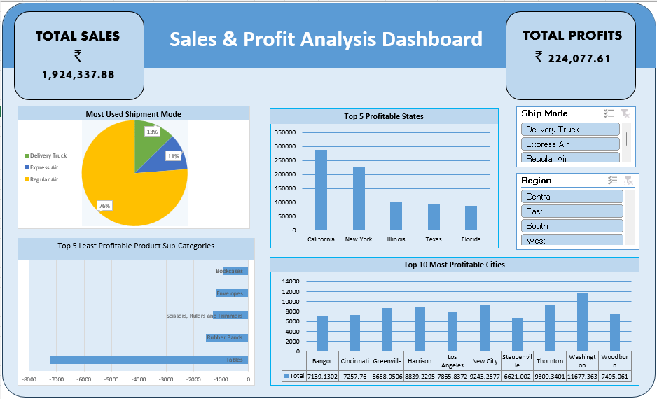

# Excel Assignments – ExcelR

This folder includes all Excel-based assignments completed during the Data Analytics course from **ExcelR**.

Each assignment demonstrates a specific concept in Excel, including data cleaning, logical reasoning, dashboard creation, and automation with VBA.

---

## 📚 Assignment Breakdown

| Assignment | Description |
|------------|-------------|
| **Q1. Arithmetic Functions** | Basic formulas for data calculation |
| **Q2. Logical Functions** | IF, AND, OR, nested conditions |
| **Q3. Lookup Functions** | VLOOKUP, HLOOKUP, INDEX-MATCH |
| **Q4. Date Functions** | Time-based calculations using Excel’s date tools |
| **Q5. Sort and Filtering** | Organizing and analyzing data efficiently |
| **Q6. Charts** | Creating dynamic visualizations using charts |
| **Q7. Dashboard** | Full Excel dashboard using Power Query, Pivot Tables, and Slicers |
| **Q8. Macro and VBA** | Task automation using Visual Basic for Applications |
| **Sales Data Set** | Raw dataset used in the dashboard for analysis |

---

### 📈 Sales and Profit Trend Analysis

---

## 🧠 Key Concepts Practiced

- Data Cleaning and Formula Application
- Logical Decision Trees
- Data Modeling using Power Pivot
- Dashboard Design with Interactive Filters
- Visual Reporting via Charts
- VBA Scripting for Automation

---

## 🛠 Tools Used

- Microsoft Excel
- Power Query, Power Pivot
- Excel Charts and Slicers
- Visual Basic for Applications (VBA)

---

## 📌 Purpose

This assignment set highlights my strong foundation in Excel, especially in solving real business problems, creating dashboards, and automating repetitive tasks. It serves as a part of my ExcelR Data Analytics certification portfolio.

