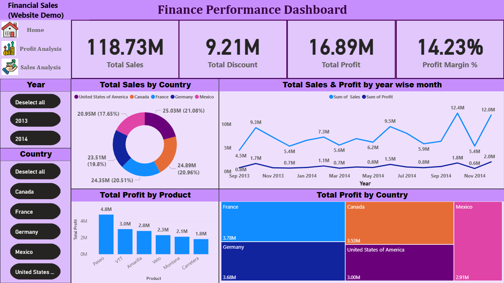
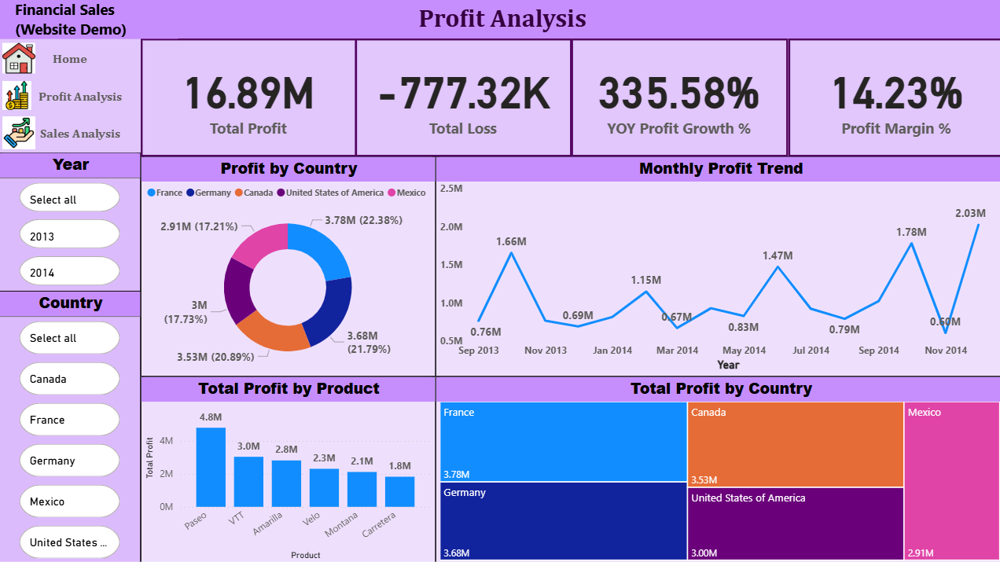
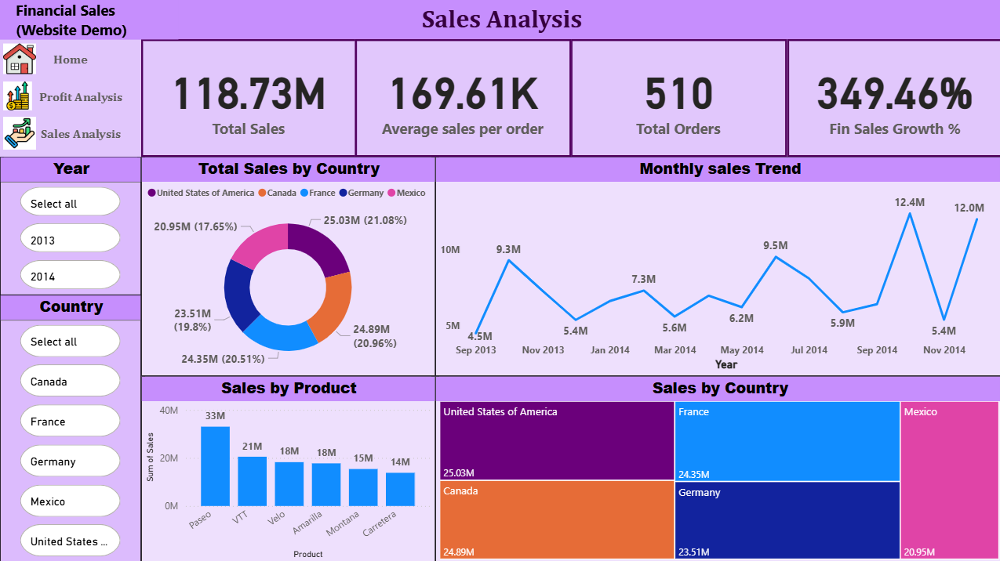

# 📊 Power BI Assignment

This repository contains a Power BI Assignments developed during a Data Analytics & Data Science course. The objective was to create a comprehensive dashboard to analyze financial and sales performance using real-world datasets.

---

## 📁 Project Structure

| File Name                        | Description                                                  |
|----------------------------------|--------------------------------------------------------------|
| `Finance dataset.xlsx`           | Raw financial dataset used in the dashboard                  |
| `Superstore Dataset.xls`         | Dataset for product, category, and region-based analysis     |
| `Power BI Assignment.pbix`       | Power BI report/dashboard file                               |
| `Power BI Assignment-Question.docx` | Assignment questions provided during the course          |
| `Financial_analysis_dashboard.png` | Screenshot of the final dashboard output                  |
| `Profit_analysis.png`            | Screenshot showing profit trends and performance             |
| `sales_analysis.png`             | Screenshot showing sales breakdown and trends                |
| `README.md`                      | This README documentation file                               |

---

## 🧑‍🎓 Course Information

- **Course Title**: Data Analytics & Data Science (Power BI Module)
- **Institute**: *ExcelR*
- **Assignment Objective**: Build a business dashboard with KPIs, visual insights, and drill-down filters.

---

## 🧠 Skills Demonstrated

- 📊 Data Cleaning & Shaping in Power BI
- 📐 DAX Measures and Calculated Columns
- 🧩 Data Modeling from multiple sources
- 📌 KPI creation and dynamic filtering
- 📈 Visual storytelling using charts and slicers

---

## 🔧 Tools Used

- Power BI Desktop
- DAX (Data Analysis Expressions)

---

## 💡 Dashboard Highlights

- **Total Revenue, Profit & Discount** KPIs
- **Region-wise & Category-wise performance**
- **Sales trends over time**
- **Dynamic filters for Sub-category, Segment, and Region**
- **Profit & loss hotspots by Product and Region**

---

## 📸 Dashboard Previews

### 📍 Final Dashboard Overview

### 📈 Profit Trend Analysis

### 🛍️ Sales Breakdown and Performance

> Screenshots captured directly from Power BI Desktop.

---

## ▶️ How to Open the Project

1. Download this repository.
2. Open the `Power BI Assignment.pbix` file using **Power BI Desktop**.
3. Ensure that `Finance dataset.xlsx` and `Superstore Dataset.xls` are in the same directory.
4. If Power BI shows broken links, go to:
   - `Home` > `Transform Data` > `Data source settings` > `Change Source`
   - Repoint to the correct local files.
5. Refresh the dashboard to update visuals.

---

## 📬 Contact Info

- **Name**: Rutikesh Pawar
- **LinkedIn**: https://www.linkedin.com/in/rutikeshpawar227
- **Email**: rutikeshpawar2000@gmail.com

---

## 📄 License

This project is for educational use only as part of a Data Analytics & Data Science course assignment.

---

