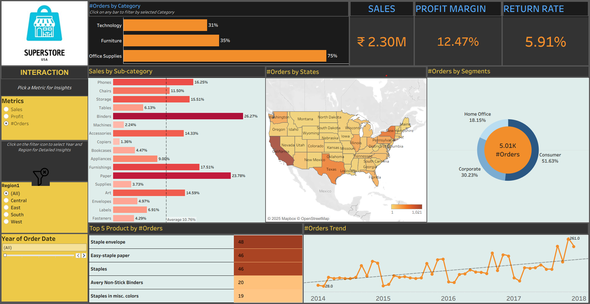

# 📊 Tableau Superstore Dashboard - Assignment Project

This repository contains a Tableau dashboard created as part of the **Tableau Module** in the **Data Analytics & Data Science** course. The dashboard provides dynamic insights into sales, profit margins, return rates, and customer behavior using the Superstore dataset.

---

## 📁 Project Structure

| File Name                      | Description                                                  |
|-------------------------------|--------------------------------------------------------------|
| `Tableau Assignments.twbx`    | Tableau packaged workbook file containing all assignments    |
| `Tableau Assignments.docx`    | Document listing all assignment instructions from the course |
| `Superstore_dashboard.png`    | Final dashboard screenshot used in the README                |
| `README.md`                   | This documentation file                                      |

---

## 🧑‍🎓 Course Information

- **Course Title**: Data Analytics & Data Science – Tableau Module
- **Institute**: ExcelR Classes.
- **Assignment Level**: Intermediate to Advanced Tableau Dashboards
- **Dataset Used**: Sample Superstore

---

## 💡 Dashboard Highlights

The Tableau dashboard is divided into two main planes:

### Left Plane (Interaction Panel):
- 📌 Company Logo (Superstore USA)
- 📊 Metric Selection Parameter (Sales, Profit, Orders)
- 🎛️ Region and Year Filters
- 🎯 Show/Hide Filter Toggle

### Right Plane (Visualizations & KPIs):
- 📈 KPI Cards: Total Sales, Profit Margin, Return Rate
- 📊 Charts:
  - Orders by Category (interactive bar chart)
  - Orders by Sub-category
  - Orders by Segment (Donut chart)
  - Orders by States (Map visualization)
  - Orders Trend (Line chart with trend line)
  - Top 5 Products by Selected Metric

---

## 📸 Dashboard Preview

---

## 🧠 Skills Demonstrated

- Tableau Dashboard Design
- Parameters and Calculated Fields
- Quick Table Calculations
- LOD Expressions (Level of Detail)
- Sets & Groups
- Custom KPI Cards
- Filters, Actions & Interactivity
- Joins & Data Blending

---

## 📋 Assignment Summary (As Per Instructions)

- [x] Metric Parameter for Sales / Profit / Orders
- [x] Region and Year filters (toggle visibility with icon)
- [x] Top 5 Products displayed consistently
- [x] Filter action on Category to impact all visuals
- [x] Trend lines, averages, and formatting applied
- [x] Custom logos and layout structure replicated
- [x] Final file exported as `.twbx` and submitted

> All 7 assignments (Table, Joins, Histogram, Pie Chart, KPI, Parameter, and Dashboard) are completed in the `.twbx` file.

---

## ▶️ How to View the Dashboard

1. Download and open `Tableau Assignments.twbx` using **Tableau Desktop or Tableau Public**.
2. Use the filters and parameter to explore the dashboard.
3. Interact with visual components like bars or segments to filter data.
4. Optional: Publish on Tableau Public for sharing with others.

---

## 🔗 Dashboard Live

> You can upload your dashboard to [Tableau Public](https://public.tableau.com/app/profile/rutikesh.pawar/)

